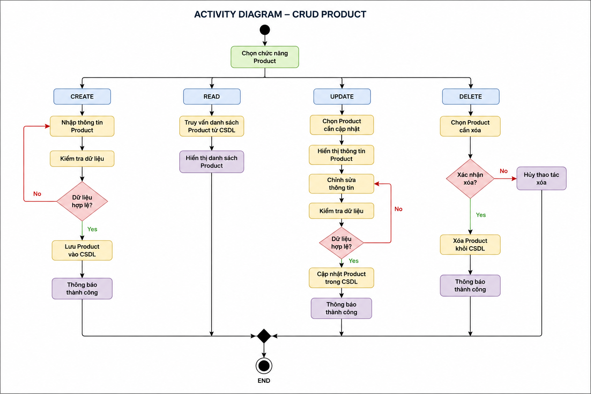

# BÀI KIỂM TRA GIỮA KỲ WEB NÂNG CAO

## Đề tài

Quản lý bán hàng

## Sinh viên thực hiện

* Họ tên: Lê Thế Khoa
* MSSV: 24103354

## Đối tượng thực hiện

Product

## Chức năng CRUD

### Create Product

* POST `/products`

### Read Product

* GET `/products`
* GET `/products/:id`

### Update Product

* PATCH `/products/:id`

### Delete Product

* DELETE `/products/:id`

## Cấu trúc thư mục

```text
database/
└── QuanLyBanHang.sql

docs/
└── activity-diagram.png

src/
└── product/
    ├── dto/
    │   ├── create-product.dto.ts
    │   └── update-product.dto.ts
    ├── entities/
    │   └── product.entity.ts
    ├── product.controller.ts
    ├── product.service.ts
    └── product.module.ts
```

## Cơ sở dữ liệu

File SQL:

```text
database/QuanLyBanHang.sql
```

## Activity Diagram



## Công nghệ sử dụng

* NestJS
* TypeScript
* MySQL
* GitHub

## Kết quả đạt được

* Xây dựng cơ sở dữ liệu Quản lý bán hàng.
* Hoàn thành CRUD cho đối tượng Product.
* Hoàn thành Activity Diagram cho CRUD Product.
* Quản lý mã nguồn bằng GitHub và lịch sử commit.
